Regression and Diagnostics
================
Brian Motherway

# Overview and Regression

In this project I am analyzing prices of houses in New Taipei City,
Taiwan with that data set that can be found at this link:
<https://archive.ics.uci.edu/dataset/477/real+estate+valuation+data+set>

``` r
library(ISLR2)
library(car)
library(leaps)
library(msm)
library(tidyverse)
library(stringr)
library(GLMsData)
library(statmod)
library(MASS)
```

``` r
#Loading my dataset
setwd("C:/Users/mothe/OneDrive/Documents/CMU/Mini 2/Statistical Foundations of Business Analytics/Data")
real_estate <- read_csv("real-estate-valuation-data-set.csv")
```

    ## Rows: 414 Columns: 4
    ## ── Column specification ────────────────────────────────────────────────────────
    ## Delimiter: ","
    ## dbl (4): age, distance, convenience_stores, unit_price
    ## 
    ## ℹ Use `spec()` to retrieve the full column specification for this data.
    ## ℹ Specify the column types or set `show_col_types = FALSE` to quiet this message.

Fitting a multi linear regression and determining if there is any issue
with collinearity by evaluating the Variance Inflation Factor (VIF).

``` r
multi_reg <- lm(unit_price ~ convenience_stores + distance, data = real_estate)
multi_reg
```

    ## 
    ## Call:
    ## lm(formula = unit_price ~ convenience_stores + distance, data = real_estate)
    ## 
    ## Coefficients:
    ##        (Intercept)  convenience_stores            distance  
    ##          39.122903            1.197599           -0.005578

``` r
vif(multi_reg)
```

    ## convenience_stores           distance 
    ##           1.569931           1.569931

Given both of the VIFs are below 5, I do not have concerns regarding
collinearity of convenience_store and distance.

I plot each predictor against the unit_price to further analyze the
relationship between each predictor and unit_price.

``` r
reg_conv <- plot(unit_price ~ convenience_stores, data = real_estate)
```

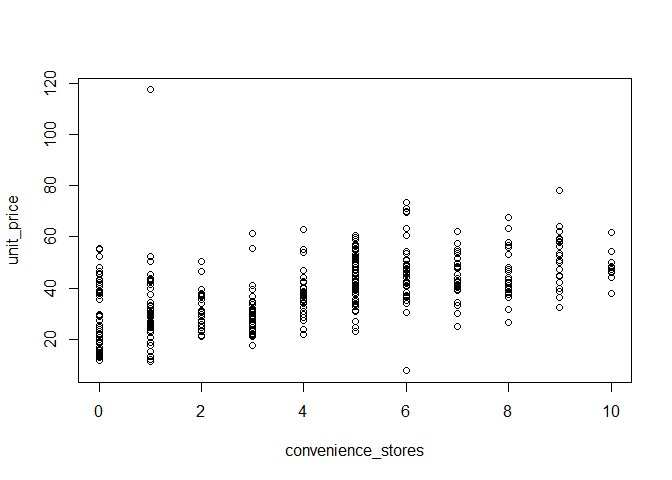<!-- -->

``` r
reg_dis <- plot(unit_price ~ distance, data = real_estate)
```

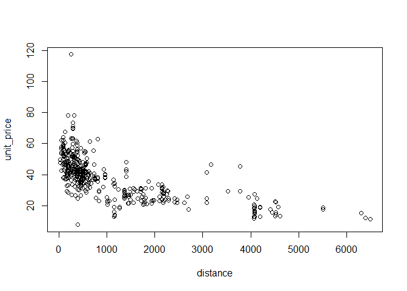<!-- -->
Based off the plot distance and unit_price it looks like this
relationship is not linear, but I want to do more investigating.

``` r
#Evaluate all three linear models
multi_reg
```

    ## 
    ## Call:
    ## lm(formula = unit_price ~ convenience_stores + distance, data = real_estate)
    ## 
    ## Coefficients:
    ##        (Intercept)  convenience_stores            distance  
    ##          39.122903            1.197599           -0.005578

``` r
conv_reg <- lm(unit_price ~ convenience_stores, data = real_estate)
dis_reg <- lm(unit_price ~ distance, data = real_estate)

#Utilize anove to conduct an F-Test comparison of the models 
anova(multi_reg, conv_reg, dis_reg, test = "F")
```

    ## Analysis of Variance Table
    ## 
    ## Model 1: unit_price ~ convenience_stores + distance
    ## Model 2: unit_price ~ convenience_stores
    ## Model 3: unit_price ~ distance
    ##   Res.Df   RSS Df Sum of Sq      F    Pr(>F)    
    ## 1    411 38493                                  
    ## 2    412 51531 -1  -13038.3 139.21 < 2.2e-16 ***
    ## 3    412 41767  0    9764.7                     
    ## ---
    ## Signif. codes:  0 '***' 0.001 '**' 0.01 '*' 0.05 '.' 0.1 ' ' 1

Based on the F-test for nested models, now we can conclude that using
convenience_stores as the only predictor of unit price is preferable.
Based on the plot of distance to unit price I can determine the
relationship appears to be exponential. Here is the plot of the
log(distance) to unit price.

``` r
log_plot_distance <- plot(unit_price ~ I(log(distance)), data = real_estate)
```

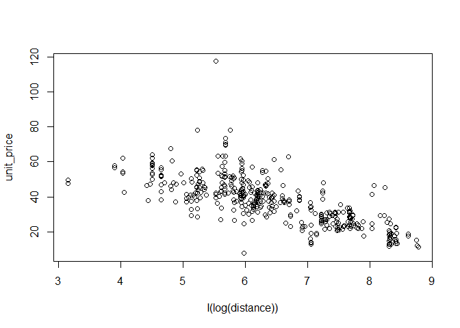<!-- -->
Relationship appears much more linear as suspected.

``` r
#Plot multiple regression of unit_price against convenience_stores and log(distance)
multi_reg_log <- lm(unit_price ~ convenience_stores + I(log(distance)), data = real_estate)
multi_reg_log
```

    ## 
    ## Call:
    ## lm(formula = unit_price ~ convenience_stores + I(log(distance)), 
    ##     data = real_estate)
    ## 
    ## Coefficients:
    ##        (Intercept)  convenience_stores    I(log(distance))  
    ##            85.8141              0.5891             -7.8611

``` r
#Evaluate which model is the best with an F-Test
anova(conv_reg, multi_reg, multi_reg_log, test = "F")
```

    ## Analysis of Variance Table
    ## 
    ## Model 1: unit_price ~ convenience_stores
    ## Model 2: unit_price ~ convenience_stores + distance
    ## Model 3: unit_price ~ convenience_stores + I(log(distance))
    ##   Res.Df   RSS Df Sum of Sq      F    Pr(>F)    
    ## 1    412 51531                                  
    ## 2    411 38493  1     13038 139.21 < 2.2e-16 ***
    ## 3    411 34570  0      3923                     
    ## ---
    ## Signif. codes:  0 '***' 0.001 '**' 0.01 '*' 0.05 '.' 0.1 ' ' 1

Model \#3 has the lowest residual sum of squares, so this appears to be
the best fit.

# Diagnostics

Now lets do some model diagnostics to confirm we have a good regression
model.

``` r
#Standardizing the residuals over the standard deviation of the residuals  
std_residuals <- rstandard(multi_reg)

#Plotting the standardized residuals of this model against the predictor convenience stores.
scatter.smooth(
  std_residuals ~ real_estate$convenience_stores,
  col = "grey",
  las = 1,
  ylab = "Standardized residuals",
  xlab = "Height (inches)"
)
```

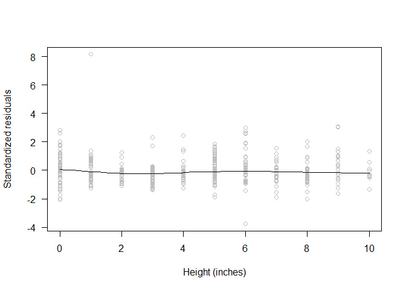<!-- -->

``` r
res_conv_plot <- ggplot(data = real_estate, aes(x = real_estate$convenience_stores, y = std_residuals)) +
  geom_point() +
  geom_smooth(se = FALSE)
res_conv_plot
```

    ## `geom_smooth()` using method = 'loess' and formula = 'y ~ x'

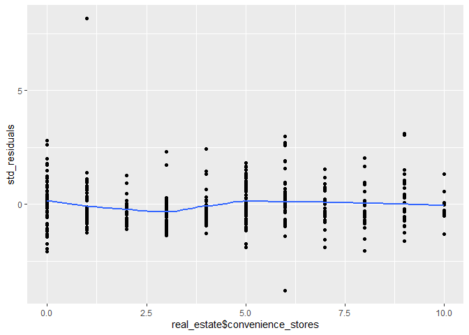<!-- -->
Generally the residuals are fairly consistent with an average
standardized residual of about 0.

``` r
#Plotting the standardized residuals of this model against the predictor logarithm of distance.
res_logdis_plot <- ggplot(data = real_estate, aes(x = log(real_estate$distance), y = std_residuals)) +
  geom_point() +
  geom_smooth(se = FALSE)
res_logdis_plot
```

    ## `geom_smooth()` using method = 'loess' and formula = 'y ~ x'

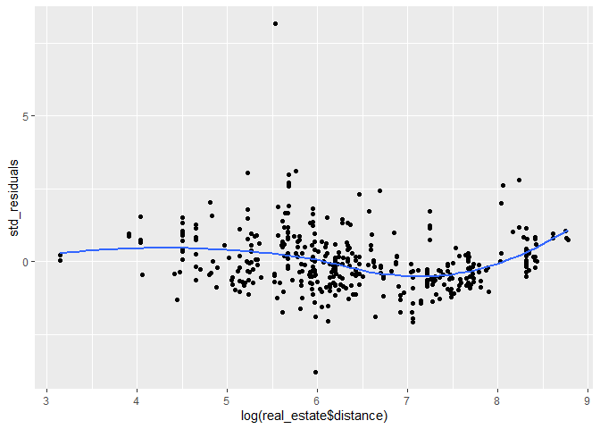<!-- -->
The standardized residuals for value of log(distance) have a trend below
zero.

``` r
multi_reg_fitted <- fitted(multi_reg_log)
res_funitprice_plot <- ggplot(data = real_estate, aes(x = multi_reg_fitted, y = std_residuals)) +
  geom_point() +
  geom_smooth(se = FALSE)
res_funitprice_plot 
```

    ## `geom_smooth()` using method = 'loess' and formula = 'y ~ x'

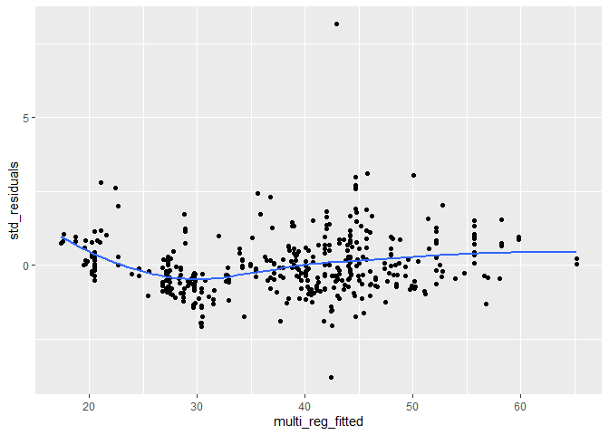<!-- -->
The standardized residuals for a unit price of greater than 50 is not
averaging zero. We may be over estimating these points.

``` r
qqnorm(std_residuals, las = 1, pch = 19)
qqline(std_residuals)
```

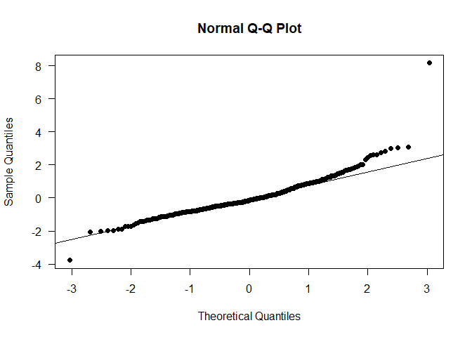<!-- -->
It looks like the model might be assuming tails that are slightly too
heavy for the model.

# Box-Cox Method

Utilizing the Box-Cox method to find the optimal transformation of
unit_price.

``` r
box_cox <- boxcox(unit_price ~ convenience_stores + log(distance), data = real_estate)
```

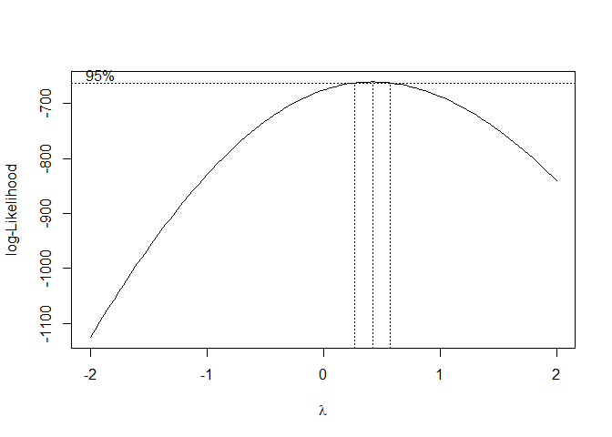<!-- -->

``` r
lambda <- box_cox$x[which.max(box_cox$y)] 
lambda
```

    ## [1] 0.4242424

Optimal lambda is found (0.42) - now we will run regression with that
transformation and compare residuals.

``` r
bc_mlr <- lm(((unit_price^lambda - 1)/ lambda)~ convenience_stores + log(distance),  data = real_estate)
summary(bc_mlr)
```

    ## 
    ## Call:
    ## lm(formula = ((unit_price^lambda - 1)/lambda) ~ convenience_stores + 
    ##     log(distance), data = real_estate)
    ## 
    ## Residuals:
    ##     Min      1Q  Median      3Q     Max 
    ## -5.8562 -0.6338 -0.0362  0.5655  6.3399 
    ## 
    ## Coefficients:
    ##                    Estimate Std. Error t value Pr(>|t|)    
    ## (Intercept)        14.65548    0.50541  28.997  < 2e-16 ***
    ## convenience_stores  0.08252    0.02532   3.259  0.00121 ** 
    ## log(distance)      -1.01747    0.06661 -15.276  < 2e-16 ***
    ## ---
    ## Signif. codes:  0 '***' 0.001 '**' 0.01 '*' 0.05 '.' 0.1 ' ' 1
    ## 
    ## Residual standard error: 1.103 on 411 degrees of freedom
    ## Multiple R-squared:  0.589,  Adjusted R-squared:  0.587 
    ## F-statistic: 294.5 on 2 and 411 DF,  p-value: < 2.2e-16

``` r
hist(multi_reg$residuals) #Original residuals
```

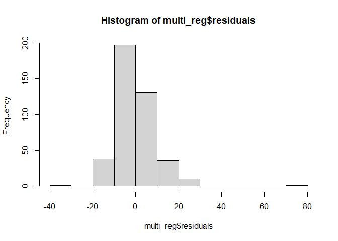<!-- -->

``` r
hist(bc_mlr$residuals) # Much more Normal-looking residuals.
```

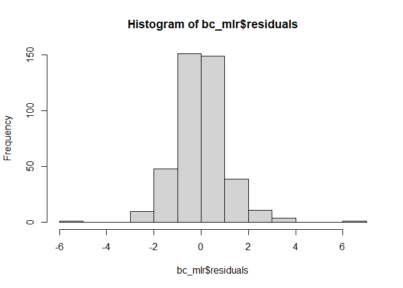<!-- -->
Residuals appear much more normal under the Box-Cox method.

# Model Diagnostics of the Box-Cox Model

``` r
#Standardized residuals
bcstd_residuals <- rstandard(bc_mlr)

#Plotting standarized residuals
scatter.smooth(
  bcstd_residuals ~ real_estate$convenience_stores,
  col = "grey",
  las = 1,
  ylab = "Standardized residuals",
  xlab = "Height (inches)"
)
```

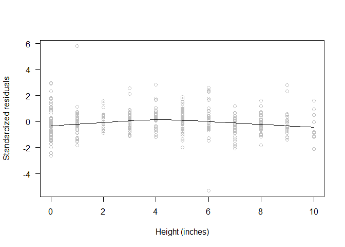<!-- -->

``` r
bcres_conv_plot <- ggplot(data = real_estate, aes(x = real_estate$convenience_stores, y = bcstd_residuals)) +
  geom_point() +
  geom_smooth(se = FALSE)
res_conv_plot
```

    ## `geom_smooth()` using method = 'loess' and formula = 'y ~ x'

<!-- -->

``` r
bcres_conv_plot
```

    ## `geom_smooth()` using method = 'loess' and formula = 'y ~ x'

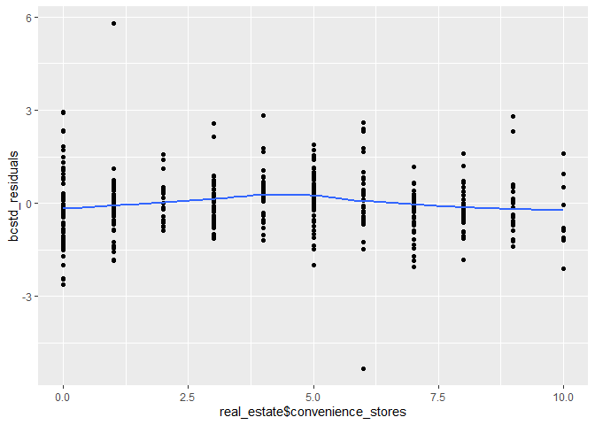<!-- -->

``` r
bcres_logdis_plot <- ggplot(data = real_estate, aes(x = log(real_estate$distance), y = bcstd_residuals)) +
  geom_point() +
  geom_smooth(se = FALSE)
res_logdis_plot
```

    ## `geom_smooth()` using method = 'loess' and formula = 'y ~ x'

<!-- -->

``` r
bcres_logdis_plot
```

    ## `geom_smooth()` using method = 'loess' and formula = 'y ~ x'

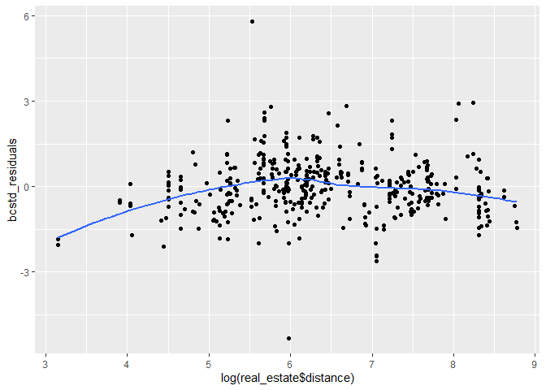<!-- -->

``` r
bc_mlr_fitted <- fitted(bc_mlr)
bcres_funitprice_plot <- ggplot(data = real_estate, aes(x = bc_mlr_fitted, y = bcstd_residuals)) +
  geom_point() +
  geom_smooth(se = FALSE)
res_funitprice_plot 
```

    ## `geom_smooth()` using method = 'loess' and formula = 'y ~ x'

<!-- -->

``` r
bcres_funitprice_plot
```

    ## `geom_smooth()` using method = 'loess' and formula = 'y ~ x'

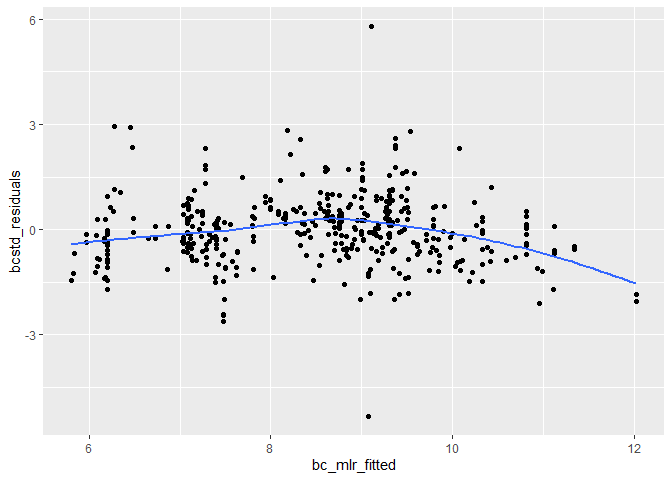<!-- -->
There is no material difference in the residuals for the boxcox plot.

``` r
qqnorm(std_residuals, las = 1, pch = 19)
qqline(std_residuals)
```

<!-- -->

``` r
qqnorm(bcstd_residuals, las = 1, pch = 19)
qqline(bcstd_residuals)
```

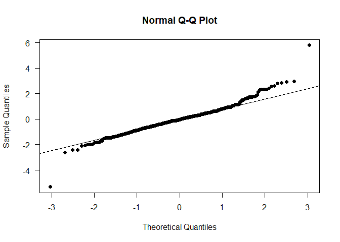<!-- -->
There is no material difference in the normality for the boxcox plot.

# Influential Observations

We will use DFBETA scores to determine if there are any concerning
influential observations.

``` r
bc_mlr_im <- influence.measures(bc_mlr)
summary(bc_mlr_im)
```

    ## Potentially influential observations of
    ##   lm(formula = ((unit_price^lambda - 1)/lambda) ~ convenience_stores +      log(distance), data = real_estate) :
    ## 
    ##     dfb.1_ dfb.cnv_ dfb.lg() dffit   cov.r   cook.d hat    
    ## 17   0.03   0.03    -0.03     0.14    0.97_*  0.01   0.00  
    ## 20  -0.30   0.14     0.31    -0.35_*  1.00    0.04   0.03_*
    ## 48   0.05  -0.06    -0.03     0.14    0.96_*  0.01   0.00  
    ## 56  -0.10   0.16     0.06    -0.22    0.97_*  0.02   0.01  
    ## 89   0.07  -0.14    -0.03     0.20    0.98_*  0.01   0.01  
    ## 106  0.03   0.03    -0.03     0.15    0.97_*  0.01   0.00  
    ## 114  0.02  -0.15    -0.03    -0.32_*  0.82_*  0.03   0.00  
    ## 124  0.03  -0.03    -0.03     0.03    1.03_*  0.00   0.03_*
    ## 127 -0.03   0.03     0.05     0.15    0.95_*  0.01   0.00  
    ## 147  0.13  -0.12    -0.12     0.14    1.03_*  0.01   0.03_*
    ## 149 -0.09  -0.05     0.14     0.29_*  0.95_*  0.03   0.01  
    ## 165  0.17  -0.16    -0.15     0.18    1.02_*  0.01   0.03_*
    ## 167  0.03   0.04    -0.03     0.16    0.96_*  0.01   0.00  
    ## 207  0.00  -0.01     0.00    -0.01    1.02_*  0.00   0.02  
    ## 221 -0.03   0.15     0.02     0.23    0.98_*  0.02   0.01  
    ## 223 -0.04   0.06     0.04     0.07    1.02_*  0.00   0.02  
    ## 229 -0.06  -0.07     0.11     0.27_*  0.95_*  0.02   0.01  
    ## 252 -0.10   0.16     0.06    -0.21    0.97_*  0.02   0.01  
    ## 271  0.68  -0.65    -0.61     0.75_*  0.79_*  0.17   0.02  
    ## 274 -0.25   0.23     0.23    -0.26_*  1.00    0.02   0.02  
    ## 276 -0.27   0.13     0.28    -0.31_*  1.01    0.03   0.03_*
    ## 286  0.03  -0.04    -0.01     0.11    0.98_*  0.00   0.00  
    ## 307  0.07  -0.06    -0.06     0.07    1.03_*  0.00   0.02  
    ## 313 -0.13   0.25     0.11     0.29_*  0.96_*  0.03   0.01  
    ## 319 -0.04   0.06     0.03     0.07    1.02_*  0.00   0.02  
    ## 331 -0.10   0.18     0.06    -0.23    0.96_*  0.02   0.01  
    ## 341  0.03  -0.04    -0.03     0.04    1.03_*  0.00   0.02  
    ## 345 -0.04  -0.06     0.08     0.22    0.98_*  0.02   0.01  
    ## 346 -0.09   0.09     0.09    -0.10    1.03_*  0.00   0.03_*
    ## 357  0.03  -0.02    -0.02     0.03    1.02_*  0.00   0.02  
    ## 380  0.03   0.03    -0.03     0.14    0.97_*  0.01   0.00  
    ## 387  0.17  -0.16    -0.16     0.18    1.02_*  0.01   0.03_*
    ## 400 -0.12   0.11     0.11    -0.12    1.02_*  0.01   0.02  
    ## 403 -0.24   0.22     0.22    -0.26_*  1.00    0.02   0.02

No observation for DFBETA were flagged as influential, we don’t need to
take any action to remove any observations.
